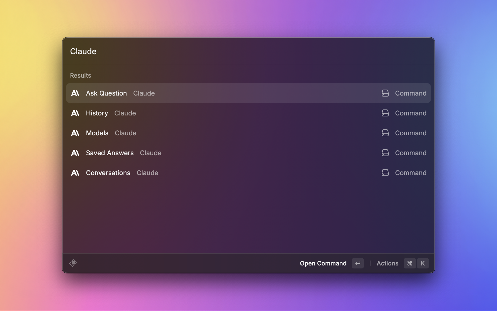

<p align="center">

</p>

<h1 align="center">Claude Compatible for Raycast</h1>

<h3 align="center">
Use your own Anthropic-compatible Messages API from Raycast
</h3>

这个本地扩展基于 Raycast 官方 `extensions/claude` 改造。它保留原有的聊天界面、流式输出、连续会话、历史记录、收藏答案、自定义模型和自动读取选中文本，并把所有模型请求发送到你配置的服务。

扩展不会内置或回退到 Anthropic 官方 API 地址。只有当你主动把 Anthropic 官方地址填入 Base URL 时，它才会连接该地址。



## 功能

- Ask Question：快速提问与继续追问。
- Conversations：保存和恢复连续对话。
- History 与 Saved Answers：浏览历史、收藏和复制答案。
- Models：创建带自定义系统提示词、温度和输出 token 上限的模型配置。
- Streaming：实时显示兼容服务返回的 SSE 文本片段。
- Selected Text：可自动载入当前应用中选中的文本。

## 接口要求

你的服务需要兼容 Anthropic Messages API：

- 请求方法与路径：`POST /v1/messages`
- 鉴权请求头：`x-api-key`
- 普通响应：Anthropic-compatible Message JSON
- 流式响应：Anthropic-compatible server-sent events (SSE)

本扩展不支持 OpenAI-compatible `/v1/chat/completions`、仅 Bearer Token 鉴权或自定义鉴权头。

### Base URL 填写方式

Base URL 是 `/v1/messages` 之前的部分，末尾斜杠会被自动移除。

例如填写：

```text
https://gateway.example.com/anthropic
```

实际请求地址是：

```text
https://gateway.example.com/anthropic/v1/messages
```

不要把完整的 `/v1/messages` 地址填入 Base URL。

## 本地安装

前置条件：

- macOS 和已安装的 Raycast
- Node.js 18 或更高版本
- 可用的 Anthropic-compatible API 地址、API Key 和模型 ID

在终端中运行：

```bash
cd extensions/claude
npm install
npm run dev
```

`npm run dev` 会构建扩展并将开发版本导入 Raycast。保持命令运行即可在修改代码后自动重新构建。

## Raycast 设置

首次打开扩展命令时，或进入 `Raycast Settings > Extensions > Claude`，填写：

| 设置                | 是否必填 | 说明                                             |
| ------------------- | -------- | ------------------------------------------------ |
| API Base URL        | 是       | 服务地址中 `/v1/messages` 之前的部分             |
| API Key             | 是       | 通过 `x-api-key` 发送给兼容服务                  |
| Default Model       | 是       | 服务支持的默认模型 ID，例如 `my-provider/sonnet` |
| Stream Responses    | 是       | 开启时使用 Anthropic-compatible SSE              |
| Auto-load           | 否       | 自动读取前台应用中选中的文本                     |
| Use Full Text Input | 否       | 首次提问时直接打开完整输入表单                   |

需要使用其他模型时，打开扩展的 `Models` 命令，新建配置并在 `Model ID` 中填写服务支持的任意标识符。

## 本地验证

```bash
npm test
npm run lint
npm run build
```

测试会启动仅监听本机的临时 HTTP 服务，分别验证普通 JSON 与 SSE 流式调用的请求路径、`x-api-key`、模型字段和响应解析，不会访问外部 API。

## Upstream

本地版本来自 [Raycast 官方 Claude 扩展](https://github.com/raycast/extensions/tree/main/extensions/claude)，沿用其 MIT 许可证和原作者信息。
